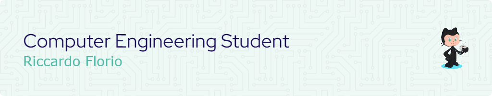

# Hi 👋, I'm an engineering student at [UNICAL](https://www.unical.it/)

## 🙋‍♂️ What about me?

- 🦾 I’m currently working on a [personal project](https://github.com/riccardo-florio/toggler-network)
- 🌱 At present, I’m learning **NodeJS, React and Tailwind**
- 👨‍💻 All of my projects are available right here on github!
- 💬 Ask me about **Matlab, Automation, Java and Web developing**
- 📫 Reach me at [**riccardo.florio20@gmail.com**](mailto:riccardo.florio20@gmail.com)
- 📄 Know about my experiences on the [about me](https://riccardoflorio.altervista.org/#about) page

<!-- - ⚡ Fun fact **TODO** -->

## 🤝 Connect with me

<!--
Link icone social: https://dev.to/envoy_/150-badges-for-github-pnk
-->

## 🔧 Languages and Tools

<!--
Link icone: https://devicon.dev/
-->

|Automation|General purpose|
|:------------:|:------------:|
| |  |

|Web developing|
|:------------:|
|       | 

|Other|
|:------------:|
   
