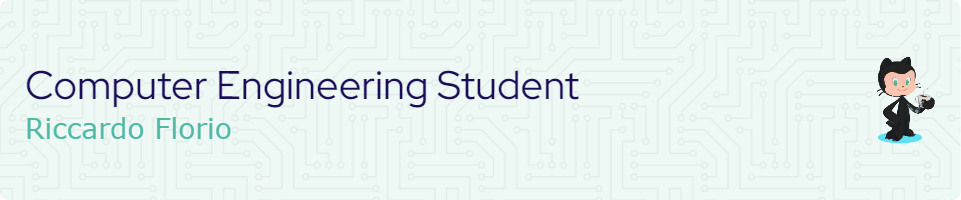
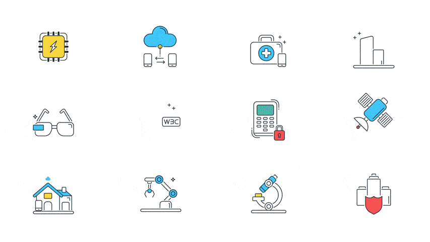

# Hi 👋, I'm Riccardo Florio
### A computer engineering student at UNICAL

---

#### What about me?

- 🦾 I’m currently working on [Industrial and mobile robotics project](https://github.com/riccardo-florio/industrial-and-mobile-robotics-project)
- 🌱 I’m currently learning **NodeJS, React and Tailwind**
- 👨‍💻 All of my projects are available at [https://riccardoflorio.altervista.org/](https://riccardoflorio.altervista.org/)
- 💬 Ask me about **Matlab, Robotics, Java, HTML, CSS, JavaScript, PHP and SQL**
- 📫 How to reach me: **riccardo.florio20@gmail.com**
- 📄 Know about my experiences on the [about me](https://riccardoflorio.altervista.org/#about) page.
- ⚡ Fun fact **TODO**

---

#### Connect with me

- [ @riccardo-florio](https://linkedin.com/in/riccardo-florio)
- [ @riccardo._.florio](https://instagram.com/riccardo._.florio)

---

#### Languages and Tools 
##### Robotics and automation

##### General purpose
 

 

##### Web developing
 
 
 
 

<!--  -->

##### Other
 
 
 

 

  

